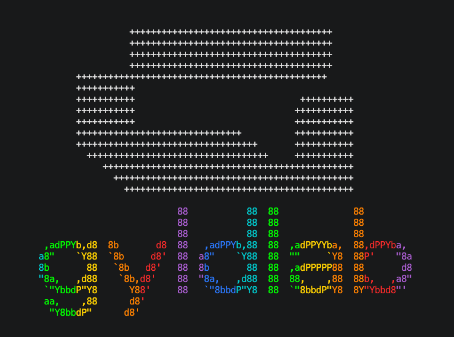

<div align="center">

# create-gyldlab-next



**Built on a foundation of _SOVEREIGN ALCHEMY_**  
_Transforming vision into production-ready Next.js applications through curated templates and add-ons._

[](https://www.npmjs.com/package/create-gyldlab-next)
[](https://opensource.org/licenses/MIT)

</div>

## Package Information

- **Package name**: `create-gyldlab-next`
- **Repository**: [gyldlab/next-app](https://github.com/gyldlab/next-app)
- **License**: MIT

## Quick Start

```bash
# Using npm create (like create-next-app)
npm create gyldlab-next my-app

# Using bun create
bun create gyldlab-next my-app

# Using pnpm create
pnpm create gyldlab-next my-app

# Using yarn create
yarn create gyldlab-next my-app

# Create in current directory
npm create gyldlab-next .

```

The package manager is auto-detected from how you invoke the CLI.

## Usage Examples

```bash
# Skip prompts with template flag
npm create gyldlab-next my-app -- --template next

# Include specific add-ons
npm create gyldlab-next my-app -- --addons gsap-lenis,shadcn

# Package manager flags (override auto-detection)
npm create gyldlab-next my-app -- -b       # Use bun
npm create gyldlab-next my-app -- -p       # Use pnpm
npm create gyldlab-next my-app -- -y       # Use yarn

# Skip dependency installation
npm create gyldlab-next my-app -- --no-install

# Show detailed error traces
npm create gyldlab-next my-app -- --debug

# List available templates
npm create gyldlab-next -- templates
```

> **Note**: When using `npm create` with flags, use `--` before the flags to pass them to the CLI.

## Package Manager

The CLI auto-detects the package manager based on how you invoke it:

| Invocation                 | Auto-detected |
| -------------------------- | ------------- |
| `npm create gyldlab-next`  | npm           |
| `bun create gyldlab-next`  | bun           |
| `pnpm create gyldlab-next` | pnpm          |
| `yarn create gyldlab-next` | yarn          |

Use flags to override auto-detection: `-b` (bun), `-p` (pnpm), `-y` (yarn).

## CLI Flags

| Flag              | Alias | Description                                          |
| ----------------- | ----- | ---------------------------------------------------- |
| `--template <id>` | `-t`  | Use a specific base template (skips template prompt) |
| `--addons <ids>`  | `-a`  | Comma-separated add-on IDs to include                |
| `--bun`           | `-b`  | Use bun as package manager                           |
| `--pnpm`          | `-p`  | Use pnpm as package manager                          |
| `--yarn`          | `-y`  | Use yarn as package manager                          |
| `--no-install`    |       | Skip dependency installation after scaffolding       |
| `--debug`         |       | Show detailed error stack traces                     |
| `--help`          | `-h`  | Show help information                                |
| `--version`       | `-V`  | Show CLI version                                     |

## Interactive Mode

When run without a template flag, the CLI launches an interactive mode with:

1. **Animated logo** - Brand display with customizable animations
2. **Template selection** - Use ↑/↓ to navigate, Enter to select
3. **Add-on selection** - Optional add-ons to enhance your project:
   - Use ↑/↓ to navigate
   - Space to toggle individual add-ons
   - 'a' to toggle all
   - Enter to continue (with selected add-ons or base only)
   - Escape to go back

You can proceed with just the base template (no add-ons) by pressing Enter without selecting any add-ons.

## Available Add-ons

- **shadcn** - shadcn/ui component library with Tailwind CSS
- **elysia** - Elysia MVC backend integration with Next.js App Router
- **gsap-lenis** - GSAP animations + Lenis smooth scrolling

Each add-on includes pre-configured AI coding skills for enhanced development assistance.

## Why this setup

- Uses TypeScript with strict settings for maintainable CLI code
- Uses a modular command structure so you can grow from one template to many
- Supports base templates and optional add-ons with skill integration
- Uses Bun for fast builds and testing
- Keeps templates inside this repository for versioned, auditable defaults
- Produces a dist output and bin entry that can be published to npm

## Local development

Install dependencies:

```bash
bun install
```

Run the CLI in development mode:

```bash
bun dev -- my-app
bun dev -- my-app --template next --addons gsap-lenis -b
```

Disable the startup banner when needed:

```bash
GYLDLAB_CLI_NO_BANNER=1 bun dev -- my-app
```

Set custom banner brand text:

```bash
GYLDLAB_CLI_BRAND="YOUR BRAND" bun dev -- my-app
```

Set custom banner font (figlet font name):

```bash
GYLDLAB_CLI_FONT="ANSI Shadow" bun dev -- my-app
```

List templates:

```bash
bun dev -- templates
```

Build the CLI:

```bash
bun run build
```

Type-check, lint, test:

```bash
bun typecheck
bun lint
bun test
```

Run add-on smoke tests:

```bash
bun smoke:gsap-lenis   # GSAP + Lenis with skills
bun smoke:shadcn       # shadcn/ui with skills
bun smoke:elysia       # Elysia MVC with skills
```

Animation guide:

- See `docs/ANIMATION_GUIDE.md` for all banner animation settings and examples.

## Testing locally before publishing

Link the CLI globally:

```bash
bun run build
bun link
```

Then test from any directory:

```bash
cd /tmp
create-gyldlab-next test-project
create-gyldlab-next test-project --template next --addons elysia,gsap-lenis -b
```

## Publishing to npm

To publish this package to npm:

1. Build the package:

   ```bash
   bun run build
   ```

2. Login to npm:

   ```bash
   npm login
   ```

3. Publish (first time):

   ```bash
   npm publish --access public
   ```

4. Publish updates:
   ```bash
   # Update version in package.json first
   npm publish
   ```

Users will then be able to run:

```bash
npm create gyldlab-next my-app
# Or with other package managers
bun create gyldlab-next my-app
pnpm create gyldlab-next my-app
yarn create gyldlab-next my-app
```

## Add your own templates

Add base templates under `templates/base/`.
Each base template folder should include a `template.json` manifest file:

```json
{
  "id": "next",
  "name": "Your Template Name",
  "description": "Short description of when to use this template.",
  "default": true
}
```

Add-ons live under `templates/addons/` with an `addon.json` manifest file:

```json
{
  "id": "your-addon",
  "name": "Your Add-on Name",
  "description": "What this add-on provides.",
  "dependencies": {
    "some-package": "^1.0.0"
  },
  "skills": {
    "bundled": ["skill-id-1", "skill-id-2"]
  }
}
```

## Project structure

```text
src/
  cli.ts              # Main CLI entry point
  commands/
    create.ts         # Project creation logic
    list-templates.ts # Template listing
  core/
    templates.ts      # Template/addon discovery
  ui/
    interactive.tsx   # Ink-based interactive UI
  utils/
    package-manager.ts
    project-name.ts
templates/
  base/
    next/
      template.json
      ...project files
  addons/
    shadcn/
    elysia/
    gsap-lenis/
```
